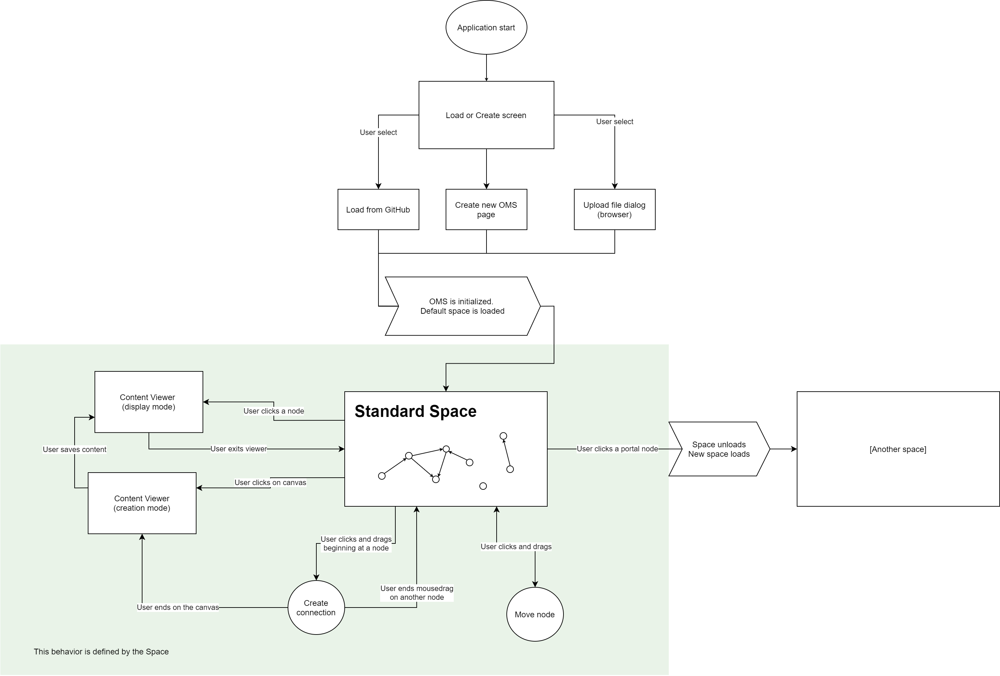

# ⚙️ Introduction

We are focusing on implementing the following user journey:

OpenMind components:

* [The OpenMind repository](OpenMindRepository.md)
* [Content Types](ContentTypes.md)
* [Content Viewers](ContentViewers.md)
