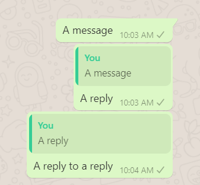
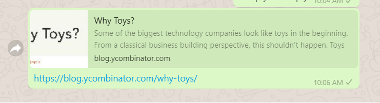

# For learning

Say you're an 18 year old who's developing expertise across various fields. 

Your information diet consists of several forms of media.

- A lot of reading
    - There's textbooks (physical and PDFs), articles, Wikipedia.
    - There are many unique media formats. Many of them are best shared as a link (such as blog posts and Wikipedia articles)
- Videos
    - Over the last few decades, a lot of the world's know-how has become accessible in video format.
    - Skills that would have otherwise required in-person training are now accessible online.

    [The YouTube Revolution in Knowledge Transfer](https://medium.com/@samo.burja/the-youtube-revolution-in-knowledge-transfer-cb701f82096a)

- Podcasts
    - Podcasts are unique in that they can be consumed during commutes or other tasks requiring low cognition.
    - One way to refer to parts of podcasts is to find and link to their transcript, or to the timestamp

Like your inputs, your outputs also vary in media

- Writing
    - You like to make notes about what you learn, and your ideas
    - Inspiration comes from all the forms of media above.
    - You work to develop hard technical knowledge during months of study and practice, but also read broadly across disciplines, learning from the world's best.
    - You write to publish.
- Podcast

    You have your own podcast, where you talk about things that interest you.

- Videos

    You're also an amateur video essayist, using YouTube to talk about your ideas.

- The Web

    A lot of what you do can be accessed via the internet, and you love putting it out there. This includes Colab notebooks, GitHub repositories, and websites you develop.

You're looking for a place to organize both your inputs and outputs, so you and other viewers can explore your work.

## The connective ether

OpenMind is a connecting platform. It's a default home for your content.

Some popular platforms that people use fail to fulfill this role:

- Pocket: Pocket is a platform for saving URLs you wish to read later. Missing features: the ability to add your own content; draw connections; query (beyond basic searches)
- Evernote/OneNote: Non-existent publishing features, lacks ability to link things
- Notion: Probably the best replacement. Limited content types.

You've tried using mindmapping tools. They've been useful for specific short-term work. If your task is something like organizing an event, or planning a study session, they're incredibly valuable. 

- **Mindmaps have a hierarchy**: There's a hierarchy to a mindmap. Ideas apart from the root node necessarily have a parent node. When you're using the tool, you're having to make the decision about where a node will be placed, or having to readjust your hierarchy later.
- **Mindmaps represent, OpenMind hosts**: Mindmaps are about spatial organization of 'ideas' which are always short pieces of text, images, or YouTube URLs.

There are common content types, but there's no telling what sort of content you will be interacting with in the long term. For example, If you decide to pursue molecular biology, your existing tools will become unsuitable for organizing your ideas and publishing your work

Regular blogging platforms like Medium/Wordpress are heavily designed around written content. 

You've tried using a personal wiki, but the MediaWiki software that runs Wikipedia is overkill to set up and use.

## A new interaction for brainstorming

**When brainstorming ideas, your flow should be uninterrupted.** I find that I often use messaging apps (like WhatsApp Web) to get things out. It's a straightforward flow: I pick a friend, a group of friends, or a private channel to throw my ideas at. There's the added advantage of receiving feedback that's a part of the flow.

### Quick content creation: An Insight from Messaging UIs

My insights from looking at messaging UIs:

- First, the ability to get things out quickly.
- The ability to reply (in effect creating a linked list where you can reference previously added ideas)

    

- Providing context to links (by crawling Open Graph data)

    

### What does this mean for OpenMind?

A good brainstorming flow will include a flow that has the spontaneity of messaging. Being able to quickly add ideas, and reference them are essential.

In addition, we're not restricting ourselves to the ability to reference a single idea. 

Some ideas are high density, and will reference previous work in detail.