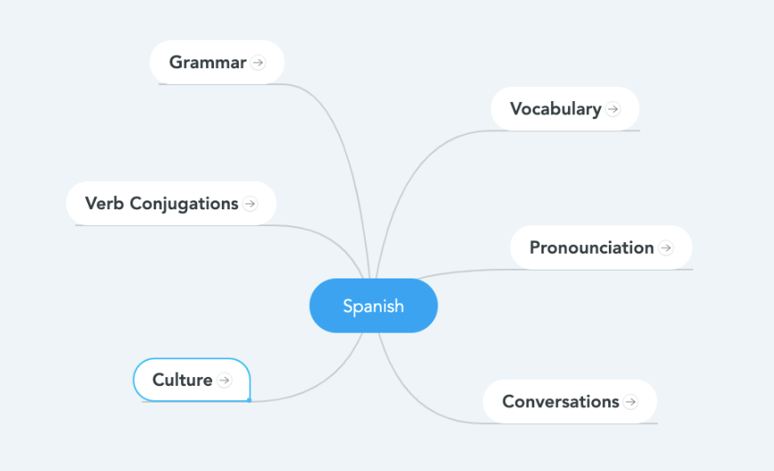
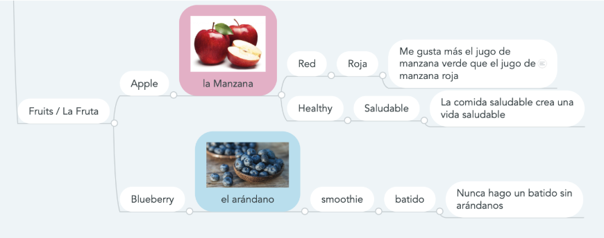

# Understanding Language

## Overview

On a mind mapping platform like Mindmeister, I currently have my Spanish learning map organized such that each node in the top level map links to another mindmap that goes into greater detail.

A look into our vocabulary map reveals the following. 

This mindmap is powerful because it uses visuals and associations to enhance the integration of new knowledge. 

## Concept

In this concept, our food space has information and connections. We’ll call these our neurons and synapses.

## Advantages over Mindmeister
